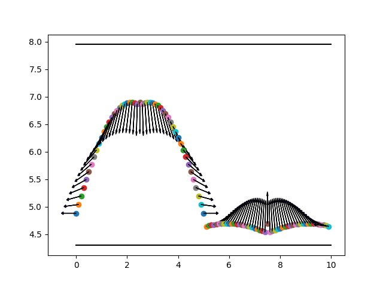
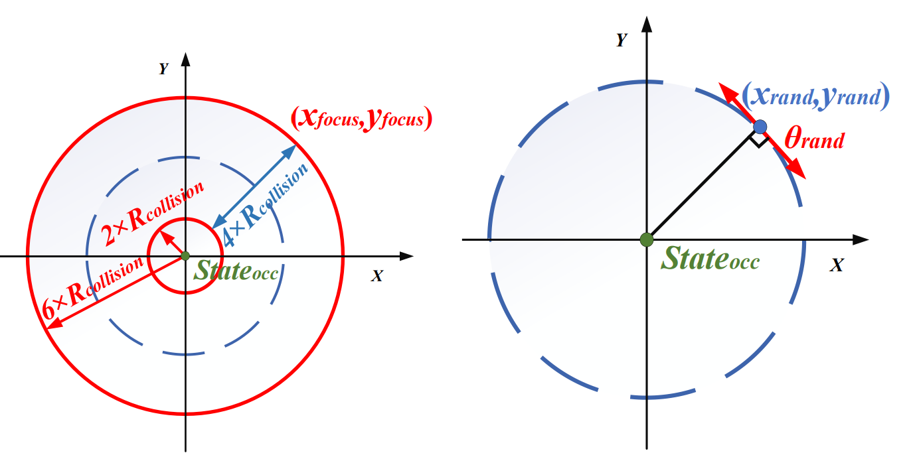
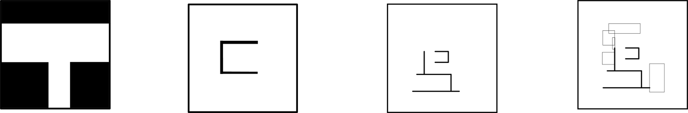

# 基于Bi-RRT*的泊车采样优化

作者：孙耀威 

来自南科大，该项目为信息技术基础课程的期末project，刚好在github上维护代码。
课程结束后发现我之前选择的是public而不是private，那就干脆补一份readme看看能不能钓上几个需要这个代码的人咯~

## 前言
本代码是基于python robotic的rrt代码的基础上一路改过来的

还有，python robotic的rrt*+reed shepp代码bug一堆


rrt代码层级关系 RRT-》RRT*-》RRT*+reed shepp-》BRRT*+reed shepp(我的)

## RRT简单介绍
### RRT*
简单介绍下rrt*，就是在rrt的基础上让所有节点尽可能的减少弯弯绕绕的路径。

每个节点与他的父亲，父亲的父亲，父亲的父亲的父亲……如果存在直接连接的路径那就直接连接

### RRT+reed shepp
RRT连接采样点使用的是直线，在节点连出的几根线之间是折角的样子，但是车辆无法跟踪折角的路线

所以使用符合车辆动力学的方法连接采样点之间的路线，也就是reed shepp曲线

reed shepp相比dubins曲线，reed shepp可以支持倒车的规划

毕竟这个项目是泊车的项目，泊车的项目车没法规划出倒车的路线是否太过……精彩？

### Bi-RRT
有一个一直没搞懂，Bi-RRT好像有个名字叫RRT-connect？好像还有个简称叫BRRT?

在rrt的基础上构建两个搜索树，一个起点搜索树一个终点搜索树，两个树平衡生长直到互相连接

## 代码简单介绍

```
rrt_star_reeds_shepp = BRRTStarReedsShepp(
    start=start_position,
    goal=end_position,
    obstacle_list=obstacleList,
    rand_area=search_area,
    max_iter=5000,
    connect_circle_dist=8.0,
    robot_radius=collision_r,
    sim_env=env0,
    grid=grid,
    # path_collision_check_mode="dichotomy"
    path_collision_check_mode="hierarchical",
    star_tree_sample_method= star_tree_sample_method
)

```

### 采样方法
采样方法设置的参数为 star_tree_sample_method

#### 均匀采样
在起点搜索树上其实这个的效果最好

参数为default

均匀采样就不上图了

#### 道路边缘采样

实现方法参考final_report.pdf 我懒得在写一遍了，反正也没人看

参数为limit

效果如图



#### 避障采样

参考 改进Bi-RRT_算法的自动泊车路径规划_姚智龙 的文献写的，文章在知网上有
参数为avoid

效果如图



#### 径向检测采样

参考 改进Bi-RRT_算法的自动泊车路径规划_姚智龙 的文献写的，文章在知网上有


用于车位上的终点搜索树，效果还不错的


### 碰撞检测方法

碰撞检测方法代码的参数为path_collision_check_mode

当不设置的时候为默认（顺序）碰撞检测

设置为dichotomy是二分碰撞检测（别问我是怎么个二分，我实现的极其蠢）

设置为hierarchical是二分层次碰撞检测，这个路径碰撞检测方法效果挺好的


#### 顺序碰撞检测方法（默认）
老老实实从头检测到尾咯

#### 二分碰撞检测
参数为 dichotomy


#### 二分层次碰撞检测
参数为 hierarchical


## 怎么运行
```
cd RRT_parking
python ir_sim.py
```
实际上我是在pycharm运行的，将hybrid_astar和ir_sim两个文件夹设置为source root才能正常运行（这应该是小问题吧？）

## 运行效果


从左到右分别是停车地图，简单地图，普通地图，复杂地图

可以看到使用二分层次碰撞检测的效果明显好于普通的顺序检测


|       Map        | Evaluate Method       | Normal Order | Binary Hierarchical Order |
|:----------------:|-----------------------|--------------|--------------------------|
|   Parking Map    |      Run Time         |    8.487s    |         6.428s           |
|                  | Average Collision Times|    5.24      |         3.3              |
|    Easy Map      |      Run Time         |   11.344s    |         4.097s           |
|                  | Average Collision Times|   47.61      |        11.92             |
|  Ordinary Map    |      Run Time         |   14.40m     |        18.70ms           |
|                  | Average Collision Times|    8.06      |         6.12             |
|   Complex Map    |      Run Time         |   51.96ms    |        30.92m            |
|                  | Average Collision Times|    8.06      |         6.38             |

## 项目评价

1. 碰撞检测方法可以用，效果确实还不错

2. 起点搜索树的采样方法效果最好的其实还是均匀采样。道路边缘采样法实现的估计有些问题，理论上不该有产生碰撞采样点的可能的，但实际上有，所以实现上有问题。

3. 代码因为项目最后需要不少比较的数据，往代码里赛了不少额外的碰撞检测以及奇奇怪怪的东西，这些东西会影响运行时间，但不会影响正确性。

4. 在泊车规划上直接使用reed shepp属于是偷懒的方法了，实际上不带改进的这样用是真的蠢！！！


5. 在采样点连接对于的搜索树的时候正常的rrt是选择搜索树上最近的点，这样没有问题。但是这对于使用reed shepp方法连接采样点跟搜索树就显得很蠢，举个例子，两个点距离最近，但是方向平行，这种情况下硬连接起来真的是蠢的离谱

    但虽然连接最近点很离谱，我也试图说搜索邻近的所有的搜索树上的点试着连接，但是后一种方法耗时太过严重了

6. 本代码不知道哪里存在问题，可以看得到在普通地图和复杂地图上的时间计量单位都是分钟了，照道理不该是这样的。

    但是好不容易熬过project了，就不折磨自己了，就这样吧。
    
    但我猜问题可能是两个方面，一个是reed shepp的计算可能太过耗时。一个是可能用reed shepp连接真的要这么多时间？
